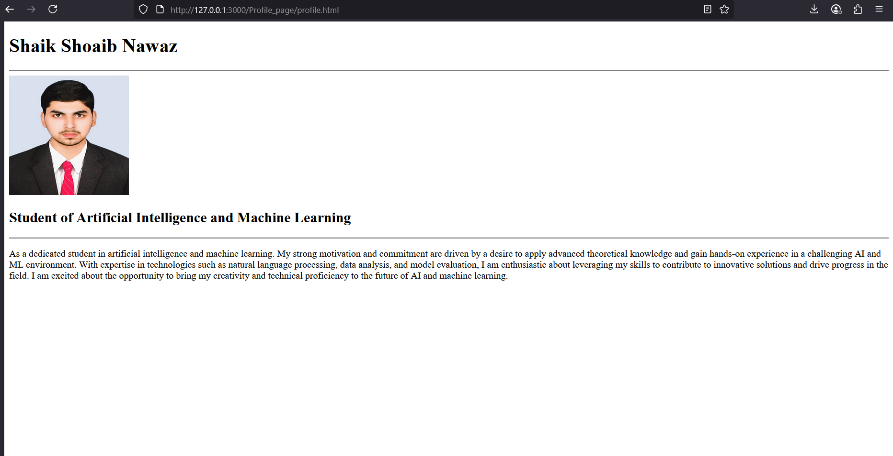

# Profile Page
## Date:07-07-2025
## Objective:

To design a simple Profile Page using HTML that displays a user's profile image, name, headings, and a short bio, suitable for personal or academic purposes.

## Tasks:

#### 1. Set Up the HTML Structure:

Use ```<!DOCTYPE html>```, ```<html>```, ```<head>```, and ```<body>``` tags to define the basic structure.

Add an appropriate <title> such as "My Profile".

#### 2. Add Page Headings:

Insert a main heading using ```<h1>``` for the user's name.

Include subheadings such as ```<h2>``` or ```<h3>``` for titles or roles (e.g., "Student", "Web Developer").

#### 3. Insert a Profile Image:

Use the `````` tag to display the user’s profile picture.

Add alt text and set basic attributes like width and height.

#### 4. Include a Short Bio Section:

Add a paragraph using <p> to provide a short introduction or biography.

The content may include education, interests, or a personal statement.

#### 5. Organize Content Using HTML Elements:

Use ```<section>```, ```<div>```, or ```<article>``` for logical grouping.

Add a horizontal line (```<hr>```) to separate sections.

#### 6. Keep the Design HTML-Only:

Do not use CSS or JavaScript.

Focus on semantic HTML and readability.
## HTML Code:
```
<!DOCTYPE html>
<html lang="en">
<head>
    <meta charset="UTF-8">
    <meta name="viewport" content="width=device-width, initial-scale=1.0">
    <title>My Profile</title>
</head>
<body>
    <section>
    <h1>Shaik Shoaib Nawaz</h1>
    <hr>
    
    <h2>Student of Artificial Intelligence and Machine Learning</h2>
    <hr>
    <article>
    <p> As a dedicated student in artificial intelligence and machine learning. My strong motivation
and commitment are driven by a desire to apply advanced theoretical knowledge and gain
hands-on experience in a challenging AI and ML environment. With expertise in
technologies such as natural language processing, data analysis, and model evaluation, I am
enthusiastic about leveraging my skills to contribute to innovative solutions and drive
progress in the field. I am excited about the opportunity to bring my creativity and technical
proficiency to the future of AI and machine learning.</p>
    </article>
    </section>
</body>
</html>
```
## Output:


## Result:
A simple Profile Page using HTML that displays a user's profile image, name, headings, and a short bio, suitable for personal or academic purposes is designed successfully.
